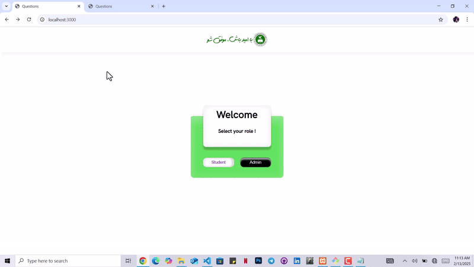

# Q&A Platform 🧠💡
A simple yet powerful Q&A platform where users can submit questions with four possible answers. Built with Node.js, Express, and MySQL, this project is designed to be fast, scalable, and easy to use.

🚀 Features
✅ Users can create and manage questions
✅ Four-option multiple-choice answers
✅ MySQL database for structured data storage
✅ RESTful API with Express.js for smooth interactions
✅ Secure and optimized backend
 # Backend: Node.js, Express.js
 # Database: MySQL
